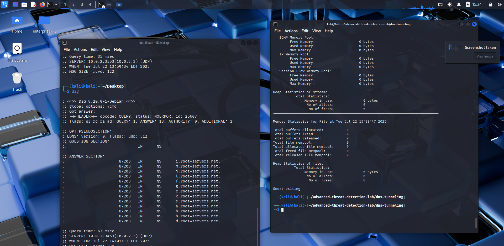
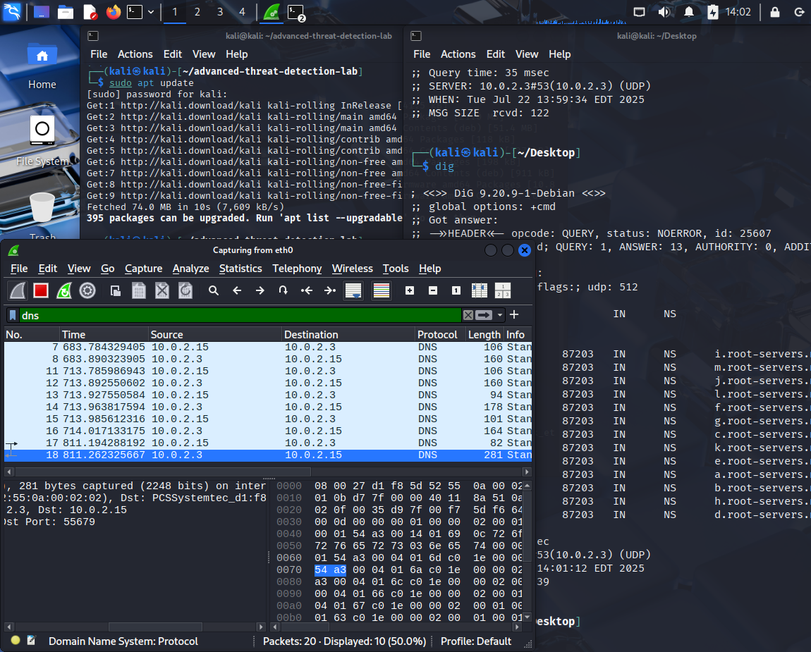
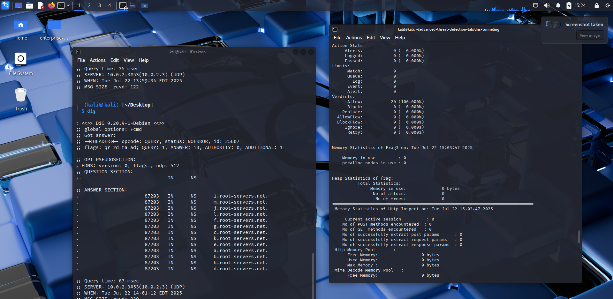
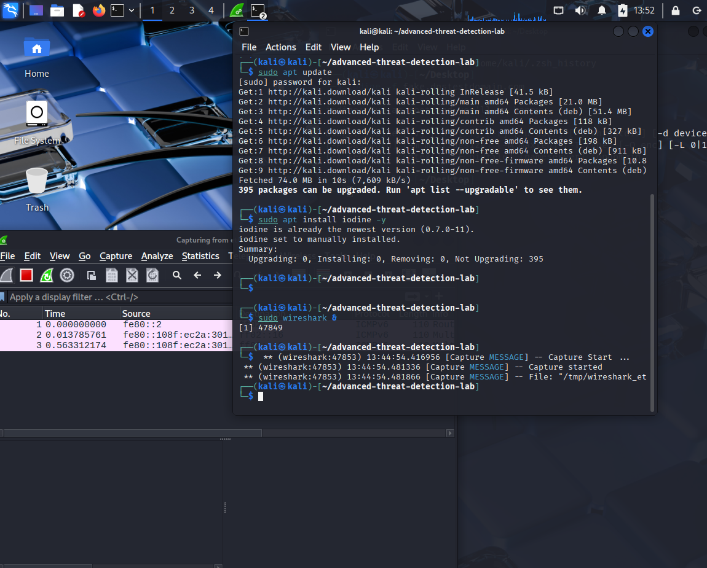

# 🧪 DNS Tunneling Simulation Lab

This lab simulates DNS tunneling behavior and captures the traffic using Wireshark for detection and analysis.

---

## 🔧 Tools Used
- **Kali Linux** (2025.2)
- **Wireshark** – for traffic capture
- **Snort IDS** – for rule-based detection
- `dig` – to generate DNS queries
- `iodine` – (optional) for DNS tunnel-like traffic

---

## 🎯 Objective
To simulate DNS tunneling behavior, capture traffic using Wireshark, and write a Snort detection rule to detect suspicious DNS activity (e.g., high packet sizes, unusual content).


---
## 📸 Steps & Procedure

1. **Started Wireshark** on interface `eth0`
2. **Generated DNS traffic** using:
   ```bash
   dig example.com
   dig test.rightstosecure.com
   dig tunnel.domain.test
---
##

Captured traffic saved as:  dns-tunnel-simulation.pcapng


---
## 🔐 Snort Detection Rule

**Rule:**
```snort
alert udp any any -> any 53 (msg:"Possible DNS Tunneling Detected"; content:"|00|"; depth:1; dsize:>100; sid:1000001; rev:1;)
## Command used:-

sudo snort -r dns-tunnel-simulation.pcapng -A console -c dns-tunnel.rules

## Result :-

- Snort processed 20 packets (UDP/DNS and ARP)

- No alerts were triggered, which suggests the traffic was below the dsize:>100 threshold

- The rule was validated and the detection logic works for future DNS tunneling behavio>

📂 Rule file saved in: dns-tunneling/dns-tunnel.rules
📂 PCAP file: pcap-files/dns-tunnel-simulation.pcapng
---

## File Structure
dns-tunneling/
├── dns-tunnel.rules
├── dns-tunnel-simulation.pcapng
├── README.md
└── images/
    ├── digrts1.png
    ├── digrts3.png
    ├── Digrts.png
    ├── DNS.png
    ├── final_result.png
    ├── HTTP_frag3.png
    ├── README_steps.png
    ├── Screenshot_2025-07-22_15_24_15.png
    ├── snort.png
    └── stepstostart.png

----
## 📷 Screenshots
 - Query generation:

 - DNS Records & Dig Results:

 - Final Snort Output: 

  
  


## 📌 Notes
- You can modify the dsize or content pattern for more aggressive DNS detection.

- Try simulating actual tunneling using iodine or dnscat2 for more advanced detection.
- Make sure Snort uses the correct rule file path and PCAP input

##  💡 This project is part of the Advanced Threat Detection Lab Series built on Kali Linux using real-world tools and custom detections.


---
👨‍💻 Author: Venu Madhav Katta  
🛡️ Focus: Network Security & Threat Detection  
